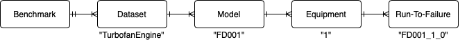

# The Prognostics Benchmark
Welcome. This repository contains the data and scripts comprising the Prognostics Benchmark. 
The Prognostics Benchmark is a novel benchmark for evaluating algorithms on prognostics applications. 
It is designed for researchers to easily share datasets and compare algorithms and is comprised of four real-world datasets, a novel evaluation metric suitable for Predictive Maintenance applications and a framework to easily contribute datasets, evaluation metrics and algorithms.
Due to its open architecture and provided tools, you can also use it as a tool for conducting research on prognostics applications.
Competitive results tied to open source code will be posted on the scoreboard.

Please cite the following publication when referring to the Prognostics Benchmark:
```
@mastersthesis{key,
  title = {Towards Generalizability and Comparability in Predictive Maintenance},
  author = {Steinroetter, Philipp, Bagdelen, Cahit},
  abstract = {With a huge revival of artificial intelligence, companies' interest in leveraging Predictive Maintenance to reduce the downtimes of their industrial equipment is on the rise. Accordingly, a lot of research is currently underway. Most research, however, focuses on finding suitable methods for only a very narrow set of machine types, which limits the generalizability of the algorithms and significantly increases the cost of deployment in an operational environment. Furthermore, research is hampered by the lack of comparability of the algorithms due to the diversity of the methods used and the sensitivity of the required data. Proposed in this thesis is both a generalizable and unsupervised algorithm for predicting machine failures and a benchmark for sharing datasets and comparing algorithms in the field of Predictive Maintenance. As the basis for both contributions, an unprecedented definition of Predictive Maintenance as a problem of artificial intelligence is given. The benchmark provides a framework within which researchers can easily contribute datasets and evaluation metrics and implement and compare their algorithms in an open but fair way. At its first publication, it already contains several open datasets and a novel cost-based evaluation metric specifically designed for Predictive Maintenance. The failure prediction algorithm is a multivariate Hierarchical Temporal Memory-based anomaly detection algorithm and uses algorithms derived from the Extreme Value theory to convert the anomaly likelihood into a discrete value indicating whether or not a maintenance alarm should be triggered. Experimental results suggest the validity of both the benchmark including the cost-based evaluation metric and the unsupervised failure prediction algorithm. While the former represents a significant step towards comparability and open research in the field of Predictive Maintenance, the latter exhibits relevant characteristics such as generalizability, interpretability and adaptability.},
  language = {en}
}
```

## Scoreboard
| detector_name                        | final_score | harddrive | water_pump | turbofan_engine | production_plant | max_processing_time_ms | avg_processing_time_ms |
|--------------------------------------|-------------|-----------|------------|-----------------|------------------|------------------------|------------------------|
| XGBRegressorDetector                 | 79.1002     | 86.1589   | 59.796     | 97.7395         | 72.7065          | 905.744                | 17.389865              |
| XGBClassifierDetector                | 78.5882     | 81.3105   | 70.5113    | 97.6755         | 64.8555          | 764.415                | 17.129426              |
| MultiModelHTMDetector                | 75.5276     | 80.6719   | 73.4685    | 70.6425         | 77.3275          | 169225.29              | 96.244571              |
| UniModelHTMDetector                  | 73.1376     | 88.3937   | 54.7285    | 71.9899         | 77.4383          | 303459.05              | 74.3737                |
| MultiModelHTMDetectorStaticThreshold | 67.502      | 87.7274   | 67.0368    | 61.6066         | 53.6373          | 61790.065              | 57.70823               |
| RunToFailureDetector                 | 61.2108     | 88.258    | 51.715     | 52.5717         | 52.2983          | 0.657                  | 0.001503               |
| AlwaysTrueDetector                   | 51.5595     | 35.6763   | 64.3532    | 52.5712         | 53.6373          | 0.399                  | 0.001512               |

## Installation
Minimum Requirements:
+ Python 3.7
+ pip
```
pip install -r requirements.txt
pip install -r requirements-pypi-test.txt -i https://test.pypi.org/simple/
```
If the second command fails due to missing versions, do not change the version of htm.core but install it from source. The respective instructions can be found [here](https://github.com/htm-community/htm.core]).

## Usage
Before using the benchmark, I strongly recommend to read chapter 4 of my thesis, which can be found under `/docs`.
Most use cases are demonstrated in [/docs/usage.ipynb](./docs/usage.ipynb).

### Where to find what
+ `/preprocessing` contains the source, the respective preprocessing script and a documentation for all datasets included in the benchmark.
+ `/prognostics_benchmark` is a module containing the benchmark itself.
+ `/results` is generated by executing `run.py` and contains the results of evaluation all algorithms on the entire benchmark using all evaluators.
+ `/docs` contains a Jupyter Notebook demonstrating basic usage.

## How to contribute
### a dataset
0. Understand the data model. Each time series is stored as a Run to Failure, meaning that it contains data from machine startup to machine failure. The following illustrates how a RtF can be defined depending on your dataset.

Each RtF belongs to an equipment, which is the physical instance of a machine. Each equipment belongs to a model, which describes its type. Each model belongs to a dataset. 

1. Create a new folder in `/preprocessing`
2. Provide a README with a short description and the source
3. If available, provide relevant documentation
4. Create a preprocessing.py script, in which the data as it is downloaded from the source is parsed and eventually added to the benchmark corpus with `data_manager.write_rtf(dataset_id, model_id, equipment_id, idx, df)`.
### an algorithm
0. Understand how an algorithm is implemented. A minimum viable example is provided in the [Run-to-Fail Algorithm](./prognostics_benchmark/detectors/rtf/rtf_detector.py). For an example on how to implement supervised algorithms, check the [XGBoost classifier](./prognostics_benchmark/detectors/xgb_classifier/xgb_classifier_detector.py). The two most important methods are `handle_record(ts, data)` and `failure_reached(rtf)`. The former is invoked from the benchmark for each record and must return a dict with at least a boolean value for is_alarm indicating whether or not to raise a maintenance alarm. In essence, is_alarm can be understood as the predicted label of a binary classifier. The latter method is called each time an RtF is fully processed and provides supervised algorithms the opportunity to (re-)train the model based on already seen data.    
1. Create a new module under `/prognostics_benchmark/detectors/`
2. Implement the algorithm as a subclass of Detector. 
3. Import the class in `/prognostics_benchmark/detectors/__init__.py`
### an evaluation metric
0. Understand how an evaluator is implemented. The three most important methods are `evaluate_rtf(df_score)`, `combine_rtf_evaluations(rtf_evaluations)` and `combine_dataset_evaluations(dataset_evaluations)`. `evaluate_rtf` must return an evaluation based on a time series of is_alarm that an algorithm has returned for the respective RtF. Both, `combine_rtf_evaluations` and `combine_dataset_evaluations`, must return a single value given a list of evaluations produced by `evaluate_rtf` or `combine_rtf_evaluations` respectively. This is similar to the conquer part of divide-and-conquer.
1. Create a new module under `/prognostics_benchmark/evaluators/`
2. Implement the evaluation metric as a subclass of Evaluator. For references, check here.
3. Import the class in `/prognostics_benchmark/evaluators/__init__.py`